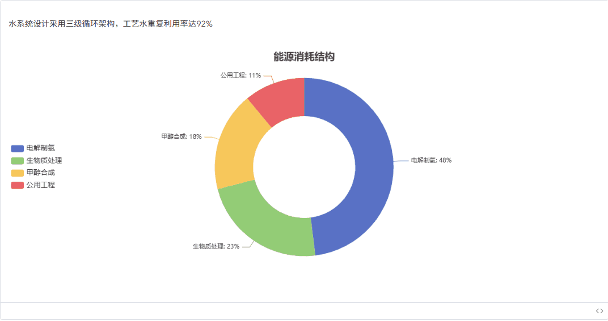

# @vunk/markdown

@vunk/markdown 是一个基于 markdown-exit 的增强型 Markdown 渲染库，专为现代 Vue3 应用设计。它的核心使命是 **增强 Markdown 内容在页面中的表现力**，通过 **自定义渲染策略** 将传统的 Markdown 文本转换为丰富的交互式组件。


[在线文档](https://eralchen.github.io/vunk-markdown/zh-CN/guide/introduction)


## 解决什么问题？

在现代应用中，特别是与 AI 大模型交互的场景下，我们经常需要：

- **渲染大模型的 Markdown 输出**：将 ChatGPT、Claude 等大模型生成的 Markdown 内容美观地展示在页面中
- **增强 Markdown 表现力**：超越传统 HTML 渲染，支持自定义组件、交互式元素
- **实时内容渲染**：支持流式渲染，适配打字机效果等动态展示需求
- **灵活的扩展能力**：根据业务需求定制特殊的 Markdown 语法和渲染效果


## 📦 安装

```bash
pnpm install @vunk/markdown -S
```


## 🚀 快速上手




查看更多 [在线用例](https://eralchen.github.io/vunk-markdown/zh-CN/guide/example-yaml)


## 🌟 为什么选择 @vunk/markdown？

- **🎯 专为现代应用设计**：完美适配 Vue3 生态和组件化开发
- **🚀 性能优异**：基于 Vue 的响应式系统，只重渲染变化的部分
- **🎨 高度可定制**：从样式到逻辑，一切都可以自定义
- **🔌 易于扩展**：插件化架构，轻松添加新功能
- **💡 面向未来**：专为 AI 时代的内容展示需求而设计


## 目录结构

```
├── app/                    # 主应用 (Vue3 SPA)
├── docs/                  # 文档站点
├── internal/              # 内部构建工具
│   ├── build-constants/   # - 构建常量
│   ├── build-utils/       # - 构建工具函数
│   └── path/             # - 路径处理工具
├── packages/              # 共享的包, 各应用可直接引用
│   ├── api/              # - API 接口
│   ├── components/       # - UI 组件
│   ├── composables/      # - 组合式函数
│   ├── entry/           # - 入口文件
│   ├── shared/          # - 共享工具/类型
│   ├── stores/          # - 状态管理
│   └── theme/           # - 主题相关
├── scripts/              # 项目脚本
│   ├── app/             # - 应用相关脚本
│   ├── build/           # - 构建脚本
│   ├── create/          # - 创建工具
│   ├── docker/          # - Docker 相关
│   └── docs/            # - 文档工具
└──  typings/            # 全局类型定义
```


## 开发说明

1. 安装依赖
```bash
pnpm install
```


2. 运行文档站点
```bash
pnpm --filter docs dev
# or
pnpm run dev
```

3. 运行主应用
```bash
pnpm --filter app dev
```

4. `packages/**` 可被打成 npm 包

```bash
pnpm build
```

## 交流群


