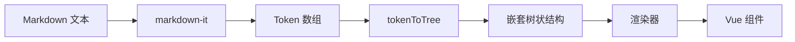

# Parse 解析

@vunk/markdown 的解析模块基于 [markdown-it](https://github.com/markdown-it/markdown-it) 构建，将 Markdown 文本转换为 **可供渲染器使用的** 嵌套树状结构。

## 🔄 解析流程

解析过程分为三个阶段：

1. **Markdown 文本** → **markdown-it tokens**（扁平数组）
2. **markdown-it tokens** → **嵌套树状结构**
3. **树状结构** → **Vue 组件渲染**（由渲染器处理）



## 🎮 交互式解析器

点击 **log** 按钮查看 Markdown 文本的解析结果，了解不同语法元素是如何被解析的。

:::demo
parse/basic
:::

## 📦 Token 结构

解析结果是一个嵌套的树状结构，每个节点都包含：

```typescript
interface RendererToken {
  templateType: string // 渲染模板类型
  type?: string // 原始 token 类型
  tag?: string // HTML 标签
  content?: string // 文本内容
  children?: RendererToken[] // 子节点
}
```

渲染策略 取决于 `templateType`，它决定了如何渲染该节点。
